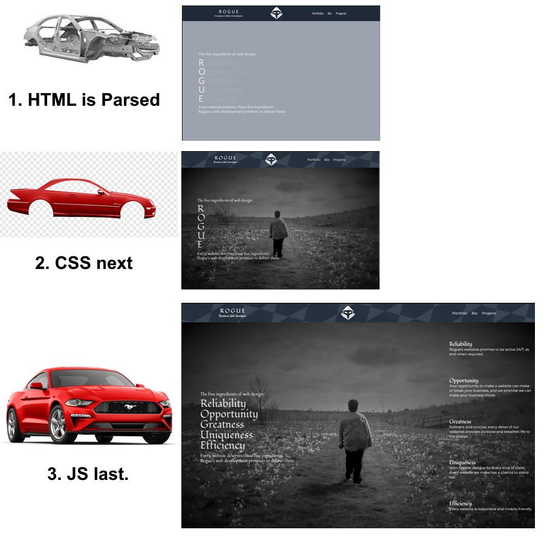

[Back to Main Page](https://roguestar112.github.io/reading-notes/)

# 009 - Setup Developer Toolbelt
<hr>
<!-- Created and Updated At Timestamps, Manually Updated. created by Demie -->
<div style="position: relative; width: 100%;">
<p style="position: absolute; left: 0;"> Created at 17/09/2023 </p>
<p style="position: absolute; right: 0;"> Updated at 17/09/2023, 21:05 </p>

</div>

<hr>

## Preface

As developers, we're constantly learning, no matter what level you're in. For instance, I don't really take notes super often, but I see that it helps me consolidate what I'm working with. In this case I'm learning how to process information and putting it into my own words. 

## How HTTP sends data between computers

*I'm going to sum this up as if this were a compelling story.*

You power on the computer. The monitor flashes, and straight-away you surf on the Web.

Your friend calls you on your phone. They're talking about how they're excited about Starfield, the game.

You get very excited, so you look up 'Starfield' on Google. It returned a wide range of results with the word 'Starfield.' 

When you click on the game's website, imagine you are driving to Starfield Land. Before you drive there, you have to know its address. This is where the DNS kicks in. The website's Domain Name System is like a destination for computers to visit.

The computer returns a bunch of its details, such as IP, to the server, in which the server gives the website's content back.

## How HTML, CSS, and JS is parsed in the browser

Imagine a car being built in the factory. The HTML is like the structure, or frame of the car.

This is to say that HTML is parsed in the browser first. Then, with any `<link>` to CSS goes next.

The CSS is like the coat of paint, and additional visuals being applied to the car.

Then, JS is like the car parts e.g. engine and tyres. They are fit in last.



## How to find images to add to a Website

There are two ways you can add images to your website:

### 1. Downloading the image
Go to your preferred search engine, and try to look up the image you want. Once you get to that image,
you right click on it and click 'Save Image As', and store it onto your computer locally.

### 2. Copying the image link as a source.
When you go to the image, left click on the image, right click the enlarged image and then click 'Open Image in New Tab', and copy the URL link.

## How to create certain data types in Javascript

You would require a variable with a value.

For instance

```js

// this is a string
let name = 'Demie';

// this is a number
let age = 24;

/* Do not use var
var Forbidden = 'Var bad!'
*/

```

A variable is an identifier which is given a value. Examples are included above.
Variables are crucial as they allow you to change values throughout your code.

Word of advice: Do not use `var` to declare a variable. This is because var is `global`, meaning
that it will work outside of functions. Use `let` instead. 


## Introduction to HTML

1. What is an HTML attribute?

HTML attributes are put within HTML tags to give extra features. For example, 

```html

<!-- Attributes here are class, and onClick.-->
<div class='red' onClick='removeRed()'>This text is red</div>
```

2. The anatomy of an HTML element is as follows:

```html

<!-- 1. A typical HTML element consists of an opening and closing tag, as well as its content inside of those tags. -->
<p>Hello World</p>

<!-- The opening tag declares the creation of an HTML element. There should be a closing tag to declare its boundaries. -->


<!-- 2. However, some elements are self-closing, such as img. -->


```

3. The difference between article and section:

Article: If the text makes sense on its own, or is intended to be reused, such a blog post, or weather widget, use `<article>`.

Section: If your page doesn't have a certain HTML tag to describe it, unlike navigation bars (`<nav>`), use `<section>`. For instance,
if you had a set of buttons in Javascript. 

[More About Articles](https://developer.mozilla.org/en-US/docs/Web/HTML/Element/article)
[More About Sections](https://developer.mozilla.org/en-US/docs/Web/HTML/Element/section)

4. A 'typical' website would include the following:

```html

<!DOCTYPE html>

<html>
    <head>
        <meta charset="utf-8" />

    </head>

    <body>
        <header>
            <h1>Header</h1>

            <nav>
                <li>Home</li>
                <li>About</li>
                <li>Projects</li>
                <li>Contacts</li>
            </nav>


        </header>

        <main>
            Lorem ipsum dolor sit amet, consectetur adipiscing elit, 
            sed do eiusmod tempor incididunt ut labore et dolore magna aliqua. Ut enim ad minim veniam
        </main>
    </body>
</html>

```

5. 

and

6. The metadata influences Search engine optimization by giving it a description that will be shown on the search engine page.
For example, with MDN Web Docs, they use the following tags to get it as the first result.

```html

<title>MDN Web Docs</title>

<meta
  name="description"
  content="The MDN Web Docs site
  provides information about Open Web technologies
  including HTML, CSS, and APIs for both websites and
  progressive web apps." />

```

The meta's description, and title is then shown on the front page.

That's pretty interesting, and I hope I can capitalize on this whenever I make websites!


