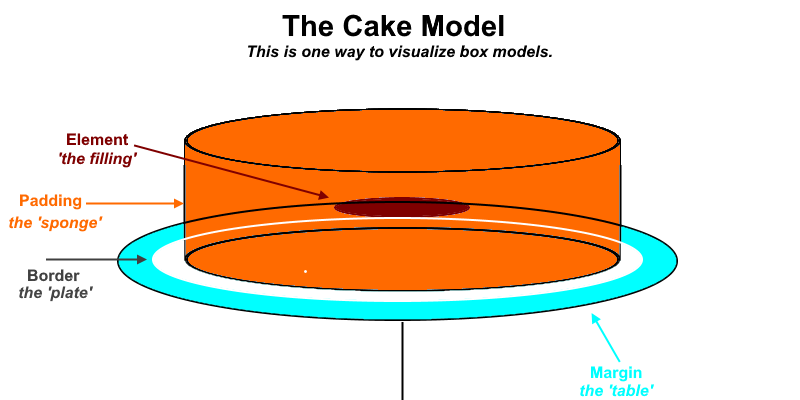

[Back to Main Page](https://roguestar112.github.io/reading-notes/)

# 011 - HTML Lists, Control Flow JS, CSS Box Model

## Learn HTML

### Ordered and Unordered Lists

1. When should you use an `unordered list` in your HTML document?
   Examples may include:

- shopping lists
- ingredients for a recipe

2. How do you change the `bullet style` of unordered list items?

To change the bullet style of unordered list items, you change the `<ul>`'s css property of `list-style-type`.
For instance:

```css
/* Example 1 */
ul {
  list-style-type: none;
}

/* Example 2 */
/* Changes the list style to a character type. */
ul {
  list-style-type: "\1F44D";
}
```

In example 1, Removes the bullet points. In example 2, changes it to the [Unicode character](https://www.compart.com/en/unicode/U+1F44D) of the 'thumbs up' emote.

3. When you should use an `ordered list` vs an `unordered list` in your HTML document?

You use ordered lists if you think the order of your items have a meaning. For instance, if you wanted to make a ranking of your favourite songs/foods or the rankings of someone in a race.

4. Describe two ways you can change the numbers of `list items` provided by an `ordered list`?

You can change the numbers on an ordered list through `attributes`. For example, `reversed` changes the order in reverse.
You can also use the `type="i"` attribute with this value, to change the list to Roman numerals.

## Learn CSS

### The Box Model

1. Box Model Analogy
   Imagine you're baking a cake, with a filling inside. The filling would be the `element` of the box model. Padding would be the spongey part.
   I'll add two additional parts, `border` is the plate and `margin` is the table.

   That's not to say you require padding, border, and margin in every element, but this is to give an idea of how it works.



2. The four parts of the box model include

- Content: This is where your text/images/other content is shown. You can use `inline-size` or `block-size` to change its size.
- Padding: This is extra space bordering your content and border.
- Margin: This is space between the border and padding, acting as negative space.

## Learn JS

1. What `data types` can you store inside of an `Array`?

Data types you can store in arrays (or lists) can include strings, booleans, numbers, objects, etc.

2. Is the people array a valid JavaScript array? If so, how can I access the values stored? If not, why?

This array:

```js
const people = [
  ["pete", 32, "librarian", null],
  ["Smith", 40, "accountant", "fishing:hiking:rock_climbing"],
  ["bill", null, "artist", null],
];
```

is valid. This is known as a `multidimensional array`. Basically it's arrays wrapped within another array. To access the values
you need to use an extra [] brace. For example, `[0][0]` accesses the first array's first element, which is "Pete". `[1][1]` would return
accountant.

3. Five shorthand operators for assignment in JavaScript:

- 1. += is to add numbers or even string concatenation.

```js

e.g.

let message = "Hello "

message += " World"

let money = 0

money += 20.42

```

- 2. `-=` is to subtract numbers only.

- 3. `*=` is to multiply the left number by the right.

- 4. `%=` is to apply a remainder.

- 5. `&&=` is to apply the AND logical operator. It applies the right side of the assignment to the left.

4. This block of code

```js
let a = 10;
let b = "dog";
let c = false;

// evaluate this
a + c + b;
```

returns '10dog'. This is probably because a is converted into a string to be concatenated to by b, and c, a boolean, is ignored entirely as a result.

5. Describe a real world example of when a conditional statement should be used in a JavaScript program.

Say if you needed a person needed to be 18+ to drink alcohol. You can use something like

```js
let canDrinkAlcohol = false;

if ((age) => 18) {
  canDrinkAlcohol = true;
}
```

6. A loop is useful in JavaScript to repeat tasks multiple times (for loops), or to make it so that the user keeps entering a value until they submit
   a valid one. (while loop).

## Reading Sources:

- [list-style-type](https://developer.mozilla.org/en-US/docs/Web/CSS/list-style-type);
- [ordered lists](https://developer.mozilla.org/en-US/docs/Web/HTML/Element/ol);
- [the box model](https://developer.mozilla.org/en-US/docs/Learn/CSS/Building_blocks/The_box_model)
